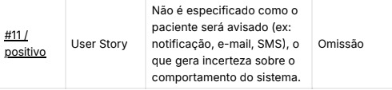
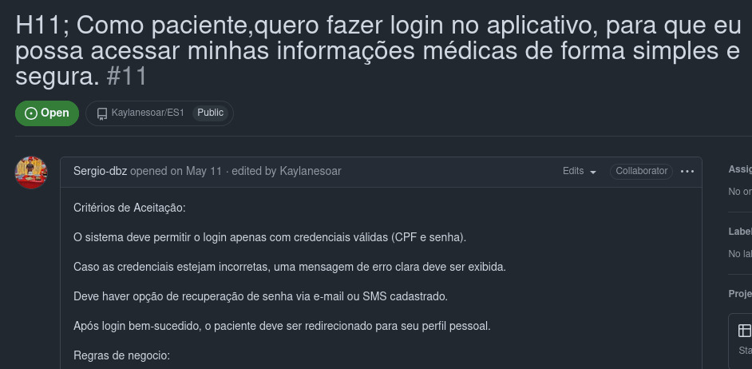
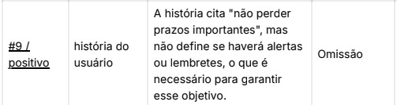
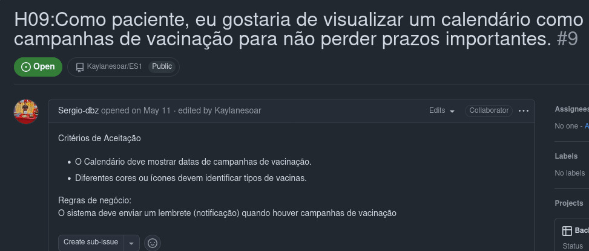
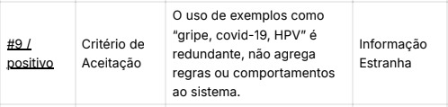
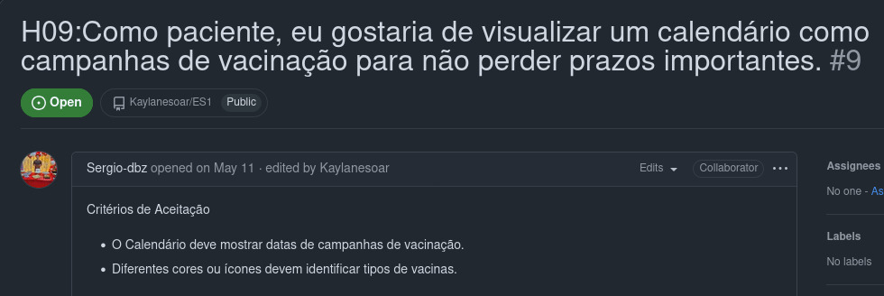

# Revisão da Inspeção de Requisitos

---

Após uma **avaliação de uma equipe externa**, recebemos uma lista detalhada dos **defeitos** encontrados no produto. Cada um desses problemas foi cadastrado como uma issue no GitHub, utilizando etiquetas (labels) específicas para facilitar a organização e o monitoramento. Com base nessas issues, as correções necessárias foram implementadas diretamente no backlog do produto. É importante notar que histórias de usuário que não estavam devidamente especificadas no backlog foram desconsideradas nesta rodada de correções, por serem consideradas inválidas para o sistema. Esse processo de correção deixou o produto mais robusto, consistente e alinhado com os padrões de qualidade exigidos. A seguir, destacamos as issues mais relevantes identificadas durante a auditoria, juntamente com os comentários da equipe externa de avaliação.

---
# H06: Ambiguidade Termo “no meu dispositivo”

# Correção feita no Backlog 

# H11: Omissão na notificação:

# Correção feita no backlog: 
imagem 4 aqui

# H09: Omissão no termo  "não perder prazos importantes"
 
# Correção no Backlog: 

# H09: Informação Estranha no uso de exemplos como “gripe, covid-19, HPV”:

# Correção no Backlog:

